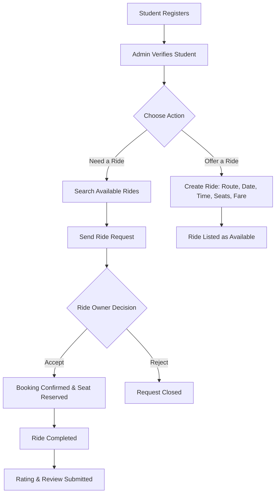

<div align="center">

# 🚗 CampusLift
### Ride-Sharing, Simplified — For Students, By Students

A university-focused ride-sharing platform that connects verified students traveling along similar routes, making campus commuting safer, more affordable, and more connected.


</div>

---

## 📋 Table of Contents

- [🚗 Project Title & Tagline](#-campuslift)
- [📖 Project Overview](#-project-overview)
- [🎯 Objectives](#-objectives)
- [❗ Problem Statement](#-problem-statement)
- [✨ Key Features](#-key-features)
- [🔄 System Workflow](#-system-workflow)
- [🧩 OOP Concepts Used](#-oop-concepts-used)
- [🏗️ Main Classes / Modules](#-main-classes--modules)
- [💻 Technologies Used](#-technologies-used)
- [📁 Project Structure](#-project-structure)
- [⚙️ Installation & How to Run](#-installation--how-to-run)
- [🚀 Future Improvements](#-future-improvements)
- [👥 Contributors](#-contributors)
- [📄 License](#-license)

---

## 📖 Project Overview

**CampusLift** is a console-based, university-focused ride-sharing platform built as an Object-Oriented Programming (OOP) course project. It allows verified students to **offer**, **search**, **request**, and **share** rides with other students traveling along similar routes.

A student can create a ride by specifying a pickup location, destination, date, time, number of available seats, and an estimated fare or contribution amount. Other students can search for rides that match their travel needs and send a request to the ride owner, who can then accept or reject it. Once accepted, the ride is confirmed as a booking, and after the trip, participants can rate and review each other.

The project demonstrates practical application of core OOP principles — encapsulation, inheritance, polymorphism, abstraction, association, exception handling, and file handling — through a realistic, multi-user system.

## 🎯 Objectives

- Design and implement a student ride-sharing system using core OOP principles.
- Provide a structured workflow for offering, searching, requesting, and booking rides.
- Demonstrate encapsulated, reusable, and maintainable class design.
- Implement persistent, file-based data storage without relying on a database.
- Apply robust exception handling to manage invalid or conflicting operations.
- Build a foundation that can be extended with a GUI, database, or web interface in the future.

## ❗ Problem Statement

Many students commute to and from campus along overlapping routes but have no simple way of knowing who else is traveling the same way. This leads to:

- Higher individual transport costs that could otherwise be shared.
- Underused seats in private vehicles, rickshaws, or ride-hailing trips.
- Limited trust when arranging informal rides through scattered social media posts or word of mouth.
- No structured way to track ride requests, confirmations, or feedback.

CampusLift addresses this by giving verified students a dedicated, structured platform to coordinate rides with peers, rather than relying on ad-hoc arrangements.

## ✨ Key Features

| Feature | Description |
|---|---|
| 🧑‍🎓 Student Registration & Verification | Students register with their academic details and are verified before accessing the platform. |
| 👤 Student Profiles | Each student has a profile containing contact info, ride history, and rating. |
| 🚘 Offer/Create a Ride | Students can create a ride with pickup point, destination, date, time, available seats, and fare. |
| 🔍 Search Available Rides | Students can search for rides matching their route, date, or time. |
| 🤝 Ride Request & Approval | Students can request to join a ride; ride owners can accept or reject requests. |
| 📅 Booking Management | Confirmed requests become bookings, tracked separately from pending requests. |
| 💺 Seat Availability | Seat counts update automatically as bookings are confirmed. |
| 💰 Estimated Fare/Contribution | Each ride carries an estimated per-seat contribution amount. |
| ⭐ Rating & Review System | Students can rate and review each other after a completed ride. |
| 🛠️ Admin Management | Admins can verify students, manage rides, and moderate the platform. |
| 💾 File-Based Data Storage | All data is persisted to local files, requiring no external database. |

## 🔄 System Workflow



## 🧩 OOP Concepts Used

| Concept | How It's Applied |
|---|---|
| **Classes & Objects** | Core entities such as `Student`, `Ride`, `RideRequest`, `Booking`, and `Rating` are modeled as classes; each registered student, ride, or booking is an object instance. |
| **Encapsulation** | Class fields (e.g., a student's contact details, a ride's seat count) are kept private and accessed only through getters/setters, protecting internal state from direct external modification. |
| **Inheritance** | A common `User` base class defines shared attributes and behavior, with `Student` and `Admin` extending it to add role-specific functionality. |
| **Polymorphism** | Method overriding is used so that shared operations (e.g., displaying a dashboard or handling permissions) behave differently for a `Student` versus an `Admin`. |
| **Abstraction** | Abstract classes/interfaces define contracts for behavior (e.g., a `Notifiable` or `Bookable` interface) without exposing implementation details to other classes. |
| **Association** | Classes are linked through relationships rather than inheritance — a `Ride` is associated with a `Student` (owner) and multiple `RideRequest`/`Booking` objects. |
| **Exception Handling** | Custom exceptions (e.g., for invalid seat counts, duplicate requests, or unverified students) are used to gracefully handle invalid operations instead of crashing the program. |
| **File Handling** | Student, ride, and booking data is read from and written to local files, providing persistence between program runs. |

## 🏗️ Main Classes / Modules

| Class / Module | Responsibility |
|---|---|
| `User` (abstract) | Base class holding common attributes (ID, name, contact info) shared by all users. |
| `Student` | Represents a verified student; can offer rides, search rides, and send requests. |
| `Admin` | Manages student verification and oversees platform data. |
| `Ride` | Represents an offered ride — route, date, time, seats, and fare. |
| `RideRequest` | Represents a student's request to join a specific ride. |
| `Booking` | Represents a confirmed ride request with reserved seats. |
| `Rating` | Stores a rating/review submitted after a completed ride. |
| `FileManager` | Handles reading from and writing to data files for persistence. |
| Custom Exceptions | E.g., `InvalidSeatException`, `RideNotFoundException`, `DuplicateRequestException` — used for controlled error handling. |
| `Main` | Entry point that drives the console-based user interaction flow. |

## 💻 Technologies Used

| Category | Technology |
|---|---|
| Language | Java |
| Data Storage | Flat files (`.txt` / serialized objects) |
| Interface | Console-based (CLI) |
| Version Control | Git & GitHub |

## 📁 Project Structure

```
CampusLift/
├── src/
│   ├── Main.java
│   ├── models/
│   │   ├── User.java
│   │   ├── Student.java
│   │   ├── Admin.java
│   │   ├── Ride.java
│   │   ├── RideRequest.java
│   │   ├── Booking.java
│   │   └── Rating.java
│   ├── services/
│   │   ├── AuthService.java
│   │   ├── RideService.java
│   │   └── BookingService.java
│   ├── exceptions/
│   │   ├── InvalidSeatException.java
│   │   ├── RideNotFoundException.java
│   │   └── DuplicateRequestException.java
│   └── utils/
│       └── FileManager.java
├── data/
│   ├── students.txt
│   ├── rides.txt
│   └── bookings.txt
├── README.md
└── LICENSE
```

## ⚙️ Installation & How to Run

**Prerequisites:** JDK 8 or later installed on your system.

```bash
# 1. Clone the repository
git clone https://github.com/<your-username>/CampusLift.git
cd CampusLift

# 2. Compile the source files
javac -d bin src/**/*.java

# 3. Run the application
java -cp bin Main
```

> Adjust package/class paths above to match your actual source layout if it differs from the structure shown.

## 🚀 Future Improvements

- Graphical User Interface (GUI) using JavaFX or Swing.
- Migration from file-based storage to a relational database.
- Real-time notifications for ride requests and status updates.
- Map-based route matching and distance estimation.
- Mobile application version.
- More granular admin analytics and reporting tools.

## 👥 Contributors

| Name | Role |
|---|---|
| Ratul | Developer |
| *(Add teammate name)* | *(Add role)* |
| *(Add teammate name)* | *(Add role)* |

*Developed as part of an Object-Oriented Programming course project at Daffodil International University (DIU).*

## 📄 License

This project is developed for academic purposes. You may license it under the [MIT License](LICENSE) or another license of your choice before publishing it publicly.

