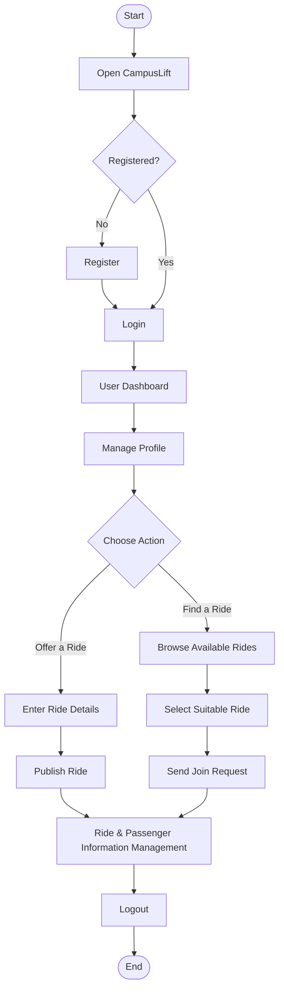

# 🚗 CampusLift

### Student Ride Sharing System

> A Java Swing-based desktop platform designed to connect university students through convenient and organized ride sharing.


---

## 📚 Table of Contents

- [Overview](#-project-overview)
- [Problem Statement](#-problem-statement)
- [Project Objectives](#-project-objectives)
- [Key Features](#-key-features)
- [System Workflow](#-system-workflow)
- [User Roles](#-user-roles)
- [Functional Modules](#-functional-modules)
- [GUI / User Interface](#️-gui--user-interface)
- [Technology Stack](#️-technology-stack)
- [Project Architecture](#️-project-architecture)
- [Project Structure](#-project-structure)
- [Installation & Setup](#️-installation--setup)
- [How to Run](#️-how-to-run)
- [Future Scope](#-future-scope)
- [Academic Context](#-academic-context)
- [Project Status](#-project-status)
- [Contriburors](#-contributor)

---

## 📌 Project Overview

**CampusLift** is a desktop application built with **Java** and **Java Swing**, developed to help university students organize and share rides with one another. Instead of relying on informal group chats or word-of-mouth arrangements, CampusLift gives students a dedicated, structured platform for posting rides, discovering available options, and connecting with other students traveling in similar directions.

The system is built around a straightforward interaction model: a student registers and logs in, manages their profile, and then either **posts a ride** they are offering or **browses rides** posted by others. From there, students can send join requests, and the system keeps track of ride and participant information so that everyone involved has a clear picture of who is going where.

The entire user experience is delivered through a **Java Swing graphical interface**, meaning students interact with the system through windows, forms, and buttons rather than a command-line interface — making the application approachable for everyday use.

CampusLift is implemented as a working desktop application, not a conceptual design — every feature described in this document reflects functionality that exists in the current codebase.

---

## 🎯 Problem Statement

University students frequently travel between campus, hostels, and nearby areas, but there is rarely a dedicated system to help them coordinate these trips efficiently. Common challenges include:

- **Difficulty finding suitable rides** — students often don't know who else is traveling in the same direction at a similar time.
- **Lack of organized ride-sharing** — arrangements are usually informal, scattered across chat groups, or based on chance encounters.
- **Disconnected students with overlapping routes** — two students heading to the same destination may never realize a ride could be shared.
- **No centralized platform for ride-related information** — there is no single place to track who is offering a ride, who has requested to join, and the relevant details of each trip.

CampusLift addresses these issues by giving students one dedicated application to post, discover, and manage rides.

---

## 🎯 Project Objectives

- Provide university students with a dedicated ride-sharing platform.
- Allow students to post rides and discover rides posted by others.
- Simplify the process of requesting and joining a ride.
- Maintain organized records of riders and passengers for each trip.
- Deliver a user-friendly desktop experience through a Java Swing GUI.
- Demonstrate practical application of Java and event-driven GUI programming.
- Keep ride-related information organized and easy to manage within the system.

---

## ✨ Key Features

### 🔐 Student Registration & Login
Students can create an account and log in to securely access their CampusLift dashboard.

### 👤 User Profile Management
Students can view and manage their basic profile information within the application.

### 🖥️ Java Swing GUI
The entire application is delivered through a graphical interface built with Java Swing, covering everything from login to ride management.

### 🚗 Ride Creation / Posting
Students can create and publish a ride, entering the relevant details for other students to view.

### 🔎 Ride Browsing
Students can browse the list of currently available rides to find one that suits their travel needs.

### 📩 Ride Request / Joining
Students can send a request to join a ride that matches their requirements.

### 👥 Rider & Passenger Management
The system keeps track of the riders offering trips and the passengers who have joined them.

### 🔄 Basic Ride Matching
CampusLift supports basic matching logic to help connect students with rides relevant to their travel details.

### 📋 Ride Information Management
Ride details can be viewed and managed through the application interface.

### 💾 Data Management
The system manages the underlying user and ride data required to keep the application functioning correctly.

---

## 🔄 System Workflow

The diagram below illustrates the complete flow of a typical CampusLift session, from application launch to logout.



---

## 👥 User Roles

CampusLift is built around a single primary interaction model: the **Student / User**.

### Student / User
A registered student can:

- Register and log in to the system
- Manage their profile information
- Post a new ride
- Browse rides posted by other students
- Request to join an available ride
- View and manage relevant ride and participant information

There is no separate administrative role implemented in the current system.

---

## 🧩 Functional Modules

| Module                     | Description                                              |
|----------------------------|-----------------------------------------------------------|
| **Authentication**         | Handles student registration and login                   |
| **Profile Management**     | Handles student profile information                       |
| **Ride Management**        | Allows students to create and manage rides                |
| **Ride Browsing**          | Displays available rides for students to explore           |
| **Ride Request**           | Allows students to request/join a ride                    |
| **Matching**               | Provides basic matching between students and rides         |
| **Participant Management** | Manages rider and passenger information for each ride     |
| **Data Management**        | Handles the storage and retrieval of application data      |
| **GUI**                    | Provides the Java Swing interface for all user interactions |

Each module operates within the desktop application and communicates through the underlying application logic to keep ride and user data consistent across screens.

---

## 🖥️ GUI / User Interface

CampusLift's entire user experience is delivered through a **Java Swing** graphical interface. The application is organized into a set of focused screens, each responsible for a specific part of the workflow:

- **Login / Registration Screen** — allows new students to register and existing students to log in.
- **Dashboard** — the central hub after login, providing access to profile management and ride actions.
- **Profile Screen** — displays and allows updates to the student's basic information.
- **Create Ride Screen** — a form-based screen for entering and publishing ride details.
- **Available Rides Screen** — lists rides currently posted by other students.
- **Ride Details Screen** — shows detailed information about a selected ride.
- **Ride Request / Joining Screen** — allows a student to send a request to join a ride.

> **Note:** Java Swing is the current and only GUI technology used in this project. No screenshots are included in this README, as none have been provided for this repository.

---

## 🛠️ Technology Stack

| Technology                    | Purpose                                    |
|--------------------------------|---------------------------------------------|
| **Java**                       | Core programming language                  |
| **Java Swing**                 | Graphical User Interface                   |
| **Object-Oriented Programming**| Application design and code organization    |
| **Data Storage**               | Storage implementation depends on the project configuration |

---

## 🏗️ Project Architecture

CampusLift follows a straightforward interaction flow between its interface and underlying logic:

```text
User
 ↓
Java Swing GUI
 ↓
Application Logic
 ↓
Ride / User Management
 ↓
Data Management
```


- **Java Swing GUI** — captures user input and displays application screens.
- **Application Logic** — processes user actions such as registration, ride posting, and ride requests.
- **Ride / User Management** — maintains the relationships between students, rides, and participants.
- **Data Management** — handles the underlying storage and retrieval of application data.

No specific architectural pattern (such as MVC or DAO) is claimed here, as this depends on the actual implementation details of the codebase.

---

## 📁 Project Structure

> The structure below is an **example layout** for illustration purposes. It does not represent confirmed file or package names from the actual repository.

```text
CampusLift/
│
├── src/
│   ├── (application source files)
│
├── resources/
│   ├── (supporting resources, if any)
│
├── README.md
└── (other project files)
```

---

## ⚙️ Installation & Setup

### Requirements

- Java JDK (a recent LTS version is recommended)
- A Java-compatible IDE (e.g., IntelliJ IDEA, Eclipse, or VS Code)
- Git

### Setup Steps

1. Clone the repository:
   ```bash
   git clone <repository-url>
   ```
2. Open the project in your preferred IDE.
3. Configure the Java JDK for the project.
4. Configure any required project dependencies.
5. Build the project.
6. Run the application's main class.

---

## ▶️ How to Run

> Run the project's main Java class from your IDE to launch the CampusLift desktop application.

Once launched, the Java Swing interface will open, allowing you to register or log in and begin using the system.

---

## 🔮 Future Scope

The following enhancements are being considered for future versions of CampusLift. These are **not** part of the current implementation.

### 💳 Online Payment Integration
Future versions may integrate secure online payment functionality for handling ride-related costs digitally.

### 🔔 Push Notifications
Future versions may introduce real-time notifications for ride requests, confirmations, updates, cancellations, and other ride-related events.

### 📱 Mobile Application
The desktop system can later be extended into a dedicated Android/iOS mobile application.

### 🤖 AI-Based Route/Ride Optimization
Future versions may use AI-based techniques to improve route planning, ride matching, and overall ride efficiency.

---

## 🎓 Academic Context

CampusLift is an academic software project developed to demonstrate practical implementation of:

- Java programming fundamentals
- Object-Oriented Programming (OOP) principles
- GUI development using Java Swing
- Event-driven programming
- Application design and organization
- Basic ride-sharing system logic

---

## 🚀 Project Status

> **Status:** Active Academic Project

This project is developed and maintained as part of an academic curriculum and is not intended for commercial deployment or production use.

---

## 👨‍💻 Contributor

| Name | Role |
|---|---|
| Md Mostak Ahmmed Ratul | Team Leader |
| Umaiya Khiyam Nira | Developer |
| Riduana Sababa Suchi | Developer |
| Tasfia Amin Rifa | Developer |
| Jannatul Niyam Tisha | Developer |
